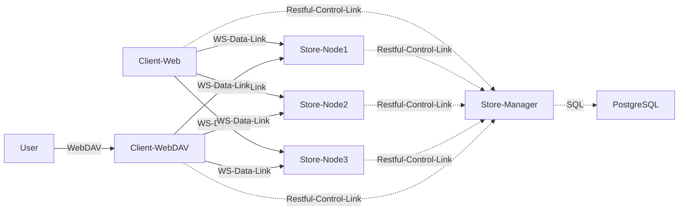

# Introduction

Introduction of Distributed-Network-Disk.

Planning architecture:

```mermaid
graph LR;
Client-Web[Client-Web]-.Restful-Control-Link.->Store-Manager[Store-Manager]
Client-Web[Client-Web]--WS-Data-Link-->Store-Node1[Store-Node1]
Client-Web[Client-Web]--WS-Data-Link-->Store-Node2[Store-Node2]
Client-Web[Client-Web]--WS-Data-Link-->Store-Node3[Store-Node3]
Store-Node1[Store-Node1]-.Restful-Control-Link.->Store-Manager[Store-Manager]
Store-Node2[Store-Node2]-.Restful-Control-Link.->Store-Manager[Store-Manager]
Store-Node3[Store-Node3]-.Restful-Control-Link.->Store-Manager[Store-Manager]
Store-Manager[Store-Manager]-.SQL.->PostgreSQL[PostgreSQL]
Client-WebDAV[Client-WebDAV]-.Restful-Control-Link.->Store-Manager[Store-Manager]
Client-WebDAV[Client-WebDAV]--WS-Data-Link-->Store-Node1[Store-Node1]
Client-WebDAV[Client-WebDAV]--WS-Data-Link-->Store-Node2[Store-Node2]
Client-WebDAV[Client-WebDAV]--WS-Data-Link-->Store-Node3[Store-Node3]
User[User]--WebDAV-->Client-WebDAV[Client-WebDAV]
```
