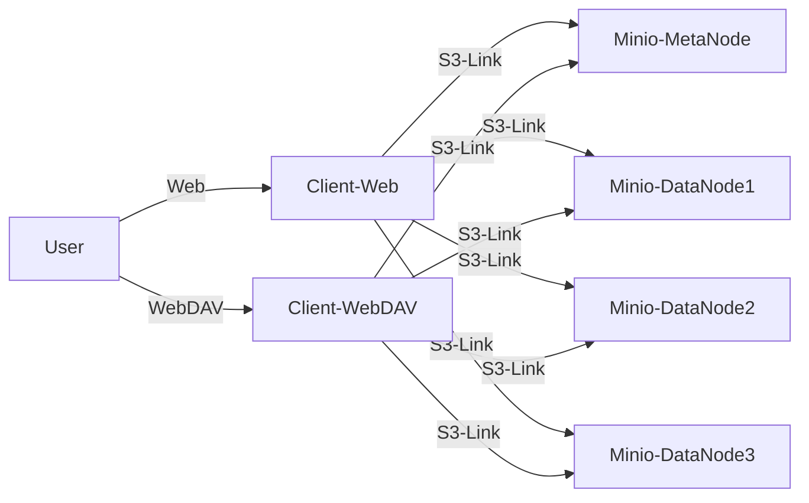
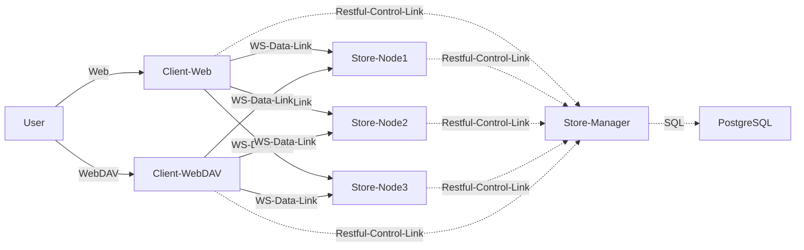

# Introduction

Introduction of Distributed-Network-Disk.

New planning architecture (**Don't Repeat Yourself**, use Minio):



Old architecture:



## MetaNode

Json files in MetaNode, which are used to store the information of the data nodes and file lists.

Var: Bucket name and Metanode uri.

```json
# nodelist.json
{
    string(id): {
        "name": string(node name),
        "url":  string(node url),
    }
}
```

```json
# filelist.json
{
    string(path+filename): {
        "shards": [
            1,
            2,
            ...
        ],
        "modified": int(unix timestamp),
        "size":  int(bytes),
    }
}
```
